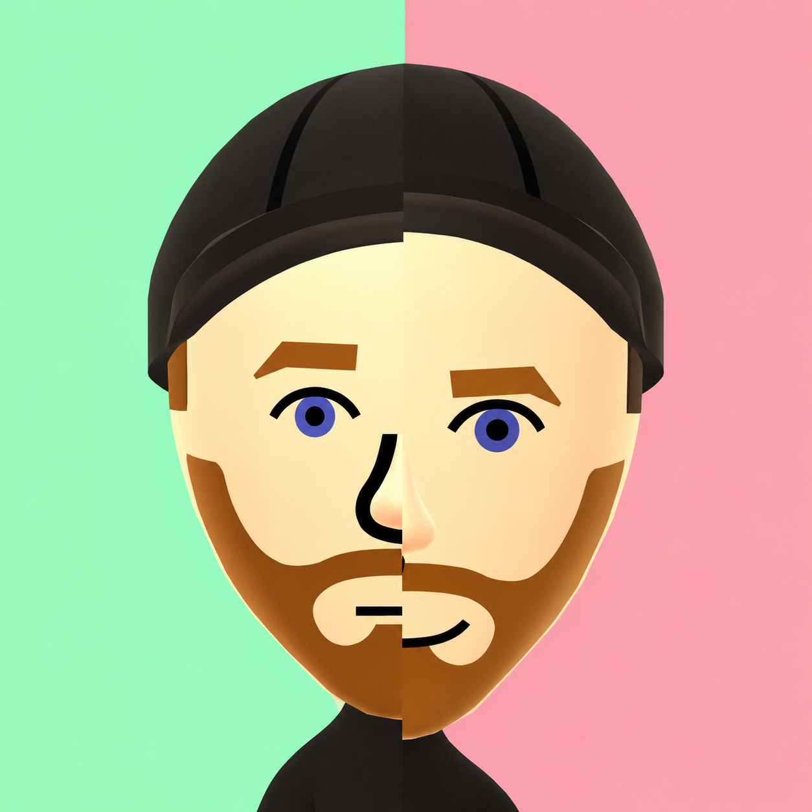
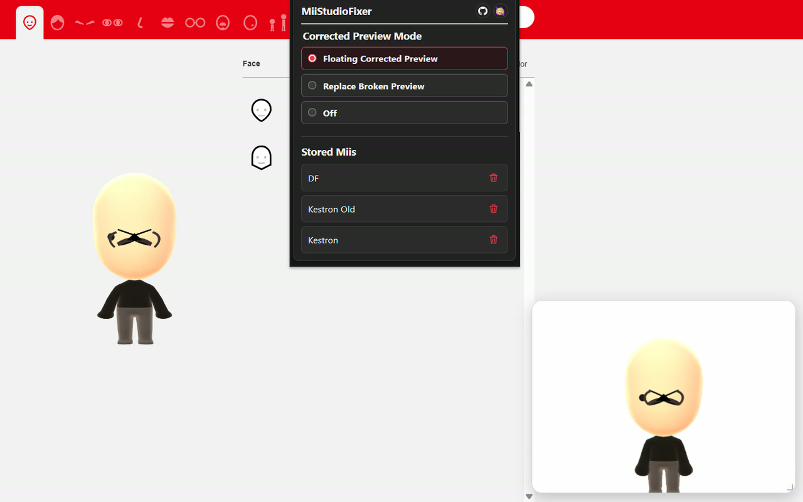
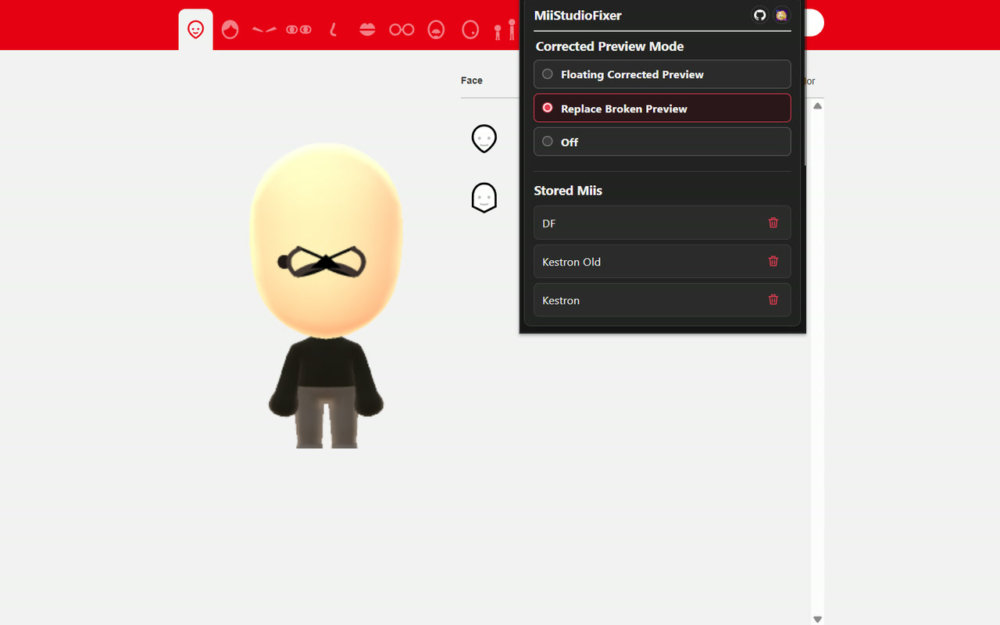
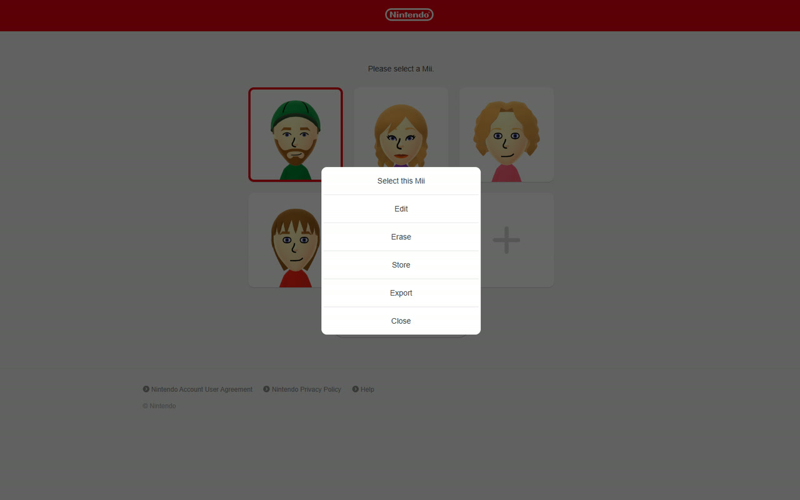
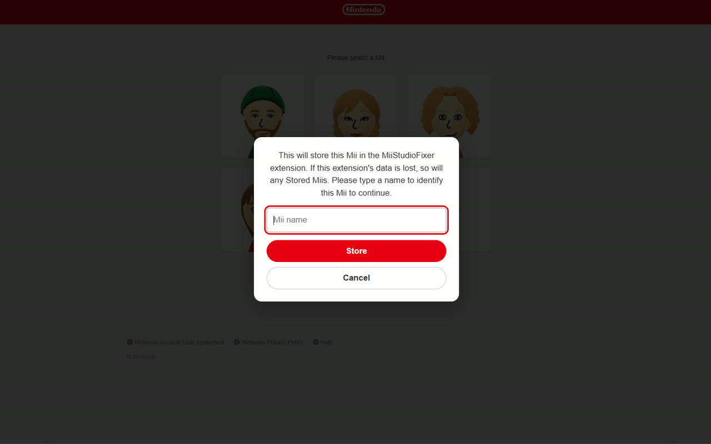
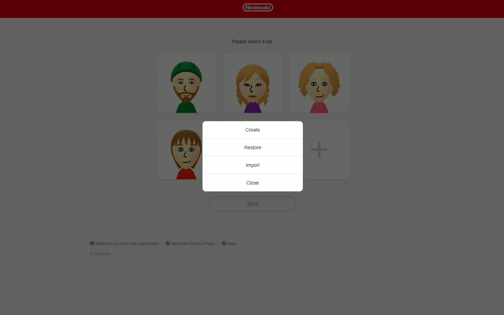

# MiiStudioFixer

MiiStudioFixer is based off of [HEYimHeroic's Mii Studio Mii Loader](https://github.com/HEYimHeroic/MiiStudioMiiLoader), and is intended to be used alongside, not necessarily to replace, however some of the things I wanted to add were more invasive to the basic UI and more outside the scope of what MSML is intended to be, and so this extension was also created, using MSML as a base.

## Correct MNMS' Abysmal Excuses for Renders

<table align="right">
  <tr>
    <td align="center">
       
      Corrected render (left) &middot; Original preview (right) Note the offset eyes, eyebrows, nose, and mouth, and elongated face. This comparison was generated by stretching the top of the hat and the bottom of the feet to be the same, so you can also see how badly the height is offset. (Upscaled to be easier to see).
    </td>
  </tr>
</table>

The main inciting thing was that it fixed Mii Studio's absolutely awful fake hacked together "renders" with the official render endpoint used when you actually save the Mii. This can be done either by a floating preview window that can be resized and dragged around freely, or by actually replacing the hacked together fake "render" with the real render entirely.

 

<table>
  <tr>
    <th align="center">Floating preview</th>
    <th align="center">Replaced preview</th>
  </tr>
  <tr>
    <td align="center" width="50%"></td>
    <td align="center" width="50%"></td>
  </tr>
  <tr>
    <td align="center">Keep the editor preview and move the corrected render around.</td>
    <td align="center">Show the corrected render in the editor itself.</td>
  </tr>
</table>

## Increase the Storage Limit - Kinda
Due to the fact the saved Miis are stored on Nintendo's servers and not locally to your device, I chose not to take the path of trying to bypass that as I've seen around. What this approach does is when you select a Mii, another option is added to the menu, being Store. After inputting a name so you can distinguish the Mii from any others you've saved, this will delete the Mii from your 6 Mii limit, freeing up a slot. It then also stores the data locally in the extension's memory instead. When you select to create a Mii, a modal has been added. This modal includes a new button to "Restore", which will show you a list of your stored Miis, and allow you to Restore any of them directly.

### While We're Messing With the UI
Import and Export buttons were also added to the edited modals simply because it didn't make sense not to have them there. They are not as featured as MSML's and not intended to compete with MSML, it just didn't make sense not to have the buttons there in the first place, _especially_ if we were already messing with those modals and already importing from a stored file anyway.

   
  Added ability to store locally.

   
  Set the name before storing in the extension locally.

   
  Restore a Mii instead of creating one.

## Using
For right now you can download the latest .zip from [Releases](https://github.com/Kestron06/MiiStudioFixer/releases). In your browser of choice, go to your extensions page, enable Dev Mode, select something to the effect of "Load Unpacked", and find the extracted zip download. Publishing to extension stores is pending.

## Privacy

See the [Privacy Policy](PRIVACY.md).
